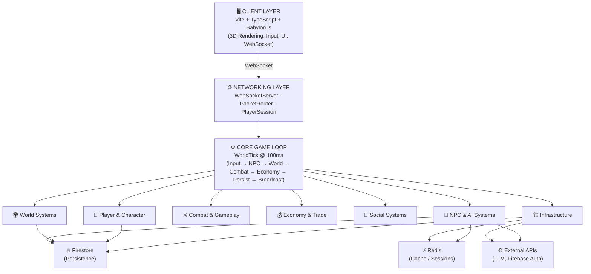
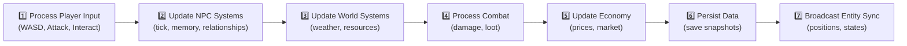
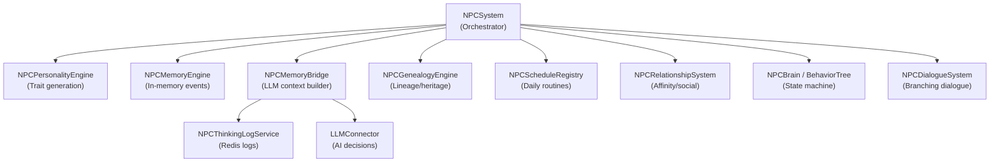
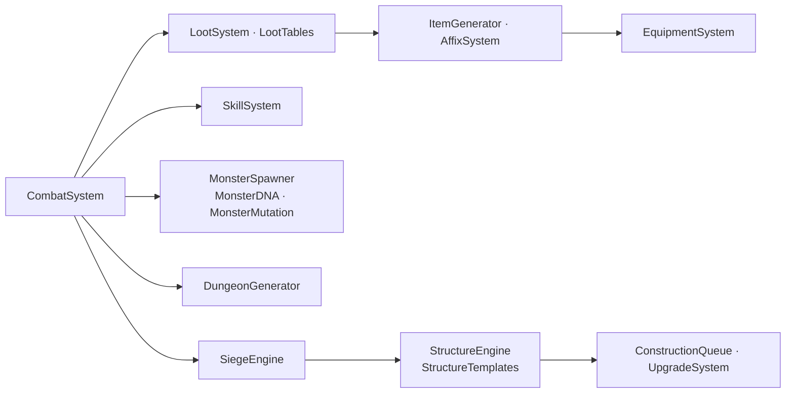
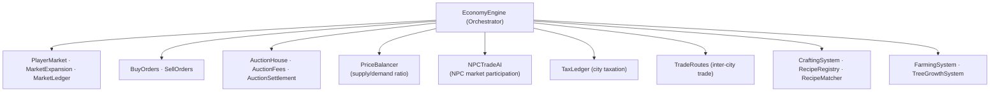

# Areloria MMORPG — WASD
 
> Structured browser MMORPG: **Node.js + WebSocket server**, **Babylon.js (Vite) client**, **`game-data/` JSON content layer**.

---

## Quick Start

```bash
# Install dependencies (workspace)
pnpm install

# Sync world assets → client/public
node scripts/sync-world-assets.mjs

# Start dev server (client + server in parallel)
pnpm run dev
```

Open `http://localhost:3000` in your browser.

---

## Stack

| Layer | Technology |
|---|---|
| Client | Vite + TypeScript + Babylon.js |
| Server | Node.js + Express + WebSocket (`ws`) |
| Auth | Firebase Auth (WS login) |
| Persistence | Firestore + local JSON fallback |
| Cache | Redis (NPC thinking logs, sessions) |
| AI / LLM | External LLM connector (NPC decisions) |
| Deploy | PM2 + Nginx + VPS (Hostinger) |

---

## Game Scene

Hub scene **`didis_hub`** with NPCs and quests defined under `game-data/` (e.g. `npc_guide`, `starter_welcome`, `village_tour`). Replace placeholder world objects in `game-data/world/objects.json` when final GLBs are ready.

---

## VPS (production)

After each deploy-worthy change on `main`:

```bash
cd /opt/areloria && bash deploy/pull-and-deploy.sh
```

Optional GitHub Secret **`DEPLOY_VERIFY_BASE_URL`** (no trailing slash) enables HTTPS checks after deploy. See **`DEPLOYMENT.md`** and **`docs/CI_VPS_RUNBOOK.md`**.

---

## Cursor MCP + VPS

See **`docs/VITE_MCP_AND_VPS_SETUP.md`** and `.cursor/mcp.json`.

---

## Contributing and agents

Every non-trivial change should update **`docs/PROJECT_STATUS_2026.md`** and, if it affects release scope, **`docs/ROADMAP_TO_RELEASE.md`**. See **`agent/AGENT_BUILD_INSTRUCTIONS.md`**.

---

---

## 🗺️ Key Services & Modules Overview

Areloria is organized into **70+ modules** grouped into clear domain layers. Below is a complete reference of every major system, its role, and how they interact.

---

### 🏛️ High-Level Architecture



---

### ⚙️ Core Game Loop — `WorldTick`

The heartbeat of the server, firing every **100 ms**:



| Sub-System | Approx. Tick Time | Complexity |
|---|---|---|
| NPCSystem | ~50 ms | O(m) active NPCs |
| ChunkSystem | < 1 ms | O(1) spatial partitioning |
| ObserverEngine | ~10 ms | O(k) visible entities |
| CombatSystem | ~20 ms | O(p) active combats |
| EconomySystem | ~5 ms | O(1) cached updates |
| LLMConnector | ~500 ms | O(1) async, non-blocking |

---

### 🌐 Networking Layer

| Module | Path | Role |
|---|---|---|
| **WebSocketServer** | `networking/WebSocketServer.ts` | Manages client connections; routes events (`input`, `interact`, `attack`); broadcasts payloads |
| **PacketRouter** | `networking/PacketRouter.ts` | Routes incoming packets to handlers; validates integrity; rate-limits |
| **PlayerSession** | `networking/PlayerSession.ts` | Holds per-player session state; syncs player data; handles logout |
| **SessionRegistry** | `auth/SessionRegistry.ts` | Registry of all active sessions |
| **SessionReconnectHandler** | `auth/SessionReconnectHandler.ts` | Re-establishes player context on reconnect |
| **SessionHeartbeat** | `auth/SessionHeartbeat.ts` | Keeps sessions alive; detects dead connections |
| **WebSocketPresence** | `auth/WebSocketPresence.ts` | Tracks online/offline presence per player |

---

### 🧠 NPC & AI Systems



| Module | Role |
|---|---|
| **NPCSystem** | Central orchestrator: spawns NPCs, runs `tick()`, handles interactions and dialogue choices |
| **NPCPersonalityEngine** | Procedurally generates personality traits (courage, curiosity, etc.) |
| **NPCMemoryEngine** | Stores and retrieves per-NPC memory entries for events |
| **NPCMemoryBridge** | Builds LLM context from Redis thinking logs; generates NPC action via AI |
| **NPCThinkingLogService** | Persists per-NPC action logs in Redis for AI summarization |
| **LLMConnector** | Sends prompts to external LLM; parses JSON action responses |
| **NPCGenealogyEngine** | Tracks NPC lineage, heritage, and family trees |
| **NPCScheduleRegistry** | Time-based daily routine definitions per NPC (e.g., guard at 6AM, sleep at 10PM) |
| **NPCRelationshipSystem** | Tracks affinity between NPCs; decays over time; enables knowledge sharing |
| **BehaviorTree / NPCBrain** | State-machine logic: `idle`, `wandering`, `interacting`, `combat` |
| **NPCDialogueSystem** | Branching dialogue engine with quest hooks, reputation checks, and flag conditions |
| **SharedMemoryNetwork** | Cross-NPC knowledge propagation network |
| **HeritageResolver** | Resolves lineage attributes for gameplay effects |
| **NPCSpawnTable** | Defines where and how NPCs are spawned |

---

### 🌍 World Systems

| Module | Role |
|---|---|
| **WorldSystem** | Top-level world orchestrator |
| **ChunkSystem / ChunkActivation** | Divides world into spatial chunks; activates/deactivates by player proximity |
| **TerrainGenerator / BiomeGenerator** | Procedural terrain and biome generation |
| **WeatherSystem / WeatherEffects** | Dynamic weather simulation and visual effects |
| **ClimateModel / WeatherPresets** | Season-based climate patterns |
| **SeasonalGrowthBridge** | Connects weather state to farming and tree growth systems |
| **ResourceSystem** | Resource node spawning and respawn timers |
| **ObserverEngine** | Tracks which entities are visible to which players |
| **NavMeshNodes / Pathfinding** | Navigation mesh for NPC pathfinding |
| **WorldObjectSystem** | Manages interactive world objects |

---

### ⚔️ Combat & Gameplay Systems



| Module | Role |
|---|---|
| **CombatSystem** | Processes attacks, damage calculations, death, and respawn |
| **LootSystem / LootTables** | Generates loot drops on kill, respecting rarity tables |
| **ItemGenerator** | Procedurally creates items from templates |
| **AffixSystem** | Attaches stat modifier affixes to items |
| **EquipmentSystem** | Manages player gear slots (weapon, armor) |
| **SkillSystem** | Skill trees, leveling, and cooldown management |
| **MonsterSpawner** | Spawns monsters per zone tables; manages aggro targeting |
| **MonsterDNA / MonsterMutation** | Procedural monster variation and trait inheritance |
| **DungeonGenerator** | Procedurally generates dungeon layouts |
| **SiegeEngine** | Manages siege warfare mechanics between structures |
| **StructureEngine / StructureTemplates** | Creates/damages persistent world structures; defines blueprints (house, forge, tower, gate) |
| **ConstructionQueue / UpgradeSystem** | Player-driven structure building and upgrades |
| **MagicSystem** | Spell definitions and magic effect processing |

---

### 💰 Economy & Trade Systems



| Module | Role |
|---|---|
| **EconomyEngine** | Top-level economy orchestrator |
| **PlayerMarket** | Player-to-player listings and trades |
| **BuyOrders / SellOrders** | Order book entries for the marketplace |
| **PriceBalancer** | Adjusts prices dynamically using `demand / supply` ratio |
| **AuctionHouse** | Timed auction system with bidding and settlement |
| **AuctionFees / AuctionSettlement** | Fee calculation and trade finalization |
| **NPCTradeAI** | Enables NPCs to buy and sell on the market |
| **TaxLedger** | Records city-level tax entries by source |
| **TradeRoutes** | Defines active trade corridors between settlements |
| **CraftingSystem / RecipeRegistry** | Player crafting with station and recipe matching |
| **FarmingSystem / TreeGrowthSystem** | Resource production from player-owned farms |

---

### 🤝 Social & Political Systems

| Module | Role |
|---|---|
| **GuildSystem / GuildStorage** | Guild creation, membership, ranks, and treasury |
| **FactionSystem / FactionMemory** | Player and NPC faction allegiance tracking |
| **ReputationSystem / ReputationLedger** | Per-faction reputation scores; title unlocks |
| **DiplomacyEngine** | Inter-faction and inter-civilization relations |
| **WarEngine** | Declares and tracks wars between factions/civilizations |
| **GovernmentTypes** | Defines government models: monarchy, council, theocracy, trade republic, warband |
| **CivilizationEngine / SettlementSystem** | Manages player civilizations and city-building |
| **ChatService / ChatChannels** | Real-time text communication and channel management |
| **ChatModeration** | Filters and moderates chat content |
| **MailService / MailAttachments** | Async in-game messaging with item attachments |
| **PartySystem / GroupFinder** | Player grouping for cooperative play |
| **FriendsSystem / IgnoreSystem** | Social relationship lists |
| **ReligionSystem** | In-world religion mechanics and temples |

---

### 🧑 Player & Character Systems

| Module | Role |
|---|---|
| **PlayerSystem** | Creates and manages player entities (stats, class, position, flags) |
| **InventorySystem** | Item storage and slot management |
| **QuestEngine / QuestRegistry**

# Arelorian / Ouroboros

Browser-based MMORPG: **authoritative Node server** + **Babylon.js client** (Vite). Gameplay data lives in **`game-data/`**; 3D assets in **`world-assets/`** and **`client/public/`**.

## Current stack (2026)

| Layer | Technology |
|-------|------------|
| **Client** | Vite, TypeScript, **Babylon.js** (`BabylonBoot`, `BabylonAdapter`), bridge pattern under `client/src/engine/bridge/` |
| **Server** | Express, WebSocket, `WorldTick` (~100 ms sim; configurable `entity_sync` interval) |
| **Data** | JSON in `game-data/` (NPCs, quests, dialogue, scenes, spawns, world objects) |

## Documentation map

- **`docs/PROJECT_STATUS_2026.md`** — what works today  
- **`docs/ROADMAP_TO_RELEASE.md`** — backlog to ship (aligned with design bible)  
- **`docs/DOCUMENTATION_INDEX.md`** — index of all docs + what is historical  
- **`docs/MASTER_DESIGN_BIBLE.md`** — creative / systems vision  
- **`AGENTS.md`** — dev commands for Cursor agents  
- **`DEPLOYMENT.md`** — VPS, PM2, GitHub Actions (Secrets inkl. optional **`DEPLOY_VERIFY_BASE_URL`**)  
- **`deploy/ENV_SETUP.md`** — `.env` auf dem VPS per Datei/SCP (ohne viele SSH-Befehle); Vorlage **`deploy/.env.production.template`**  

## Prerequisites

- **Node.js** 18+ (22 recommended for VPS parity)
- **pnpm** (see lockfile) or npm as used in `package.json` scripts

## Install and run

```bash
pnpm install
cp .env.example .env   # optional for local dev
pnpm run dev           # server with Vite middleware (see AGENTS.md for watch gotcha)
```

Production-style:

```bash
pnpm run build
pnpm run start
```

## Architecture (short)

- **Networking**: WebSocket — `login`, `input`, `move_intent`, `interact`, `dialogue_choice`, `quest_accept`, `entity_sync`, etc.
- **Client entry**: `client/src/main.ts` → `MMORPGClientCore` → `connectSocket`
- **Server core**: `server/src/core/WorldTick.ts`, `server/src/networking/WebSocketServer.ts`

## Starter content (Millbrook)

Hub scene **`didis_hub`** with NPCs and quests defined under `game-data/` (e.g. `npc_guide`, `starter_welcome`, `village_tour`). Replace placeholder world objects in `game-data/world/objects.json` when final GLBs are ready.

## VPS (production)

After each deploy-worthy change on `main`:

```bash
cd /opt/areloria && bash deploy/pull-and-deploy.sh
```

Optional GitHub Secret **`DEPLOY_VERIFY_BASE_URL`** (no trailing slash) enables HTTPS checks after deploy. See **`DEPLOYMENT.md`** and **`docs/CI_VPS_RUNBOOK.md`**.

## Cursor MCP + VPS

See **`docs/VITE_MCP_AND_VPS_SETUP.md`** and `.cursor/mcp.json`.

## Contributing and agents

Every non-trivial change should update **`docs/PROJECT_STATUS_2026.md`** and, if it affects release scope, **`docs/ROADMAP_TO_RELEASE.md`**. See **`agent/AGENT_BUILD_INSTRUCTIONS.md`**.
