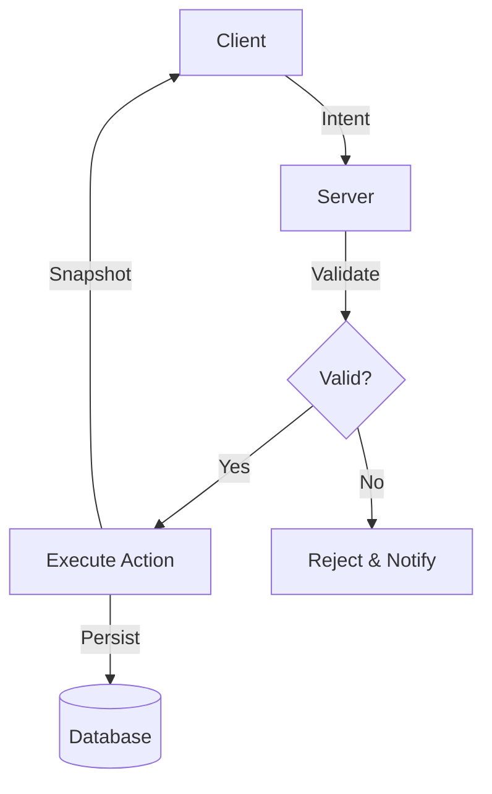

# Documentation Components

This page showcases Mintlify components available for documentation.

## Cards

Cards highlight content with customizable containers and icons.

<Card title="Server Authority" icon="server" href="/mintlify/architecture/server">
  All game state is validated and mutated authoritatively on the server.
</Card>

<Card title="Determinism" icon="hash" href="/mintlify/architecture/determinism">
  Every gameplay outcome is reproducible from explicit inputs.
</Card>

### CardGroup

<CardGroup cols={2}>
  <Card title="NPC Systems" icon="users">
    Autonomous NPCs with memory and reputation
  </Card>
  <Card title="Quest System" icon="scroll">
    Tasks, objectives, and questlines
  </Card>
  <Card title="Combat" icon="swords">
    Combat mechanics and skills
  </Card>
  <Card title="Economy" icon="coins">
    Resource economy and trading
  </Card>
</CardGroup>

## Tabs

Organize related content into switchable tabbed views.

<Tabs>
  <Tab title="pnpm">
    ```bash
    pnpm install
    pnpm build
    ```
  </Tab>
  <Tab title="npm">
    ```bash
    npm install
    npm run build
    ```
  </Tab>
  <Tab title="yarn">
    ```bash
    yarn install
    yarn build
    ```
  </Tab>
</Tabs>

## Steps

Display sequential instructions in a numbered format.

<Steps>
  <Step title="Clone the Repository">
    Clone the repository to your local machine
    ```bash
    git clone https://github.com/OuroborosCollective/Areloria-WASD.git
    ```
  </Step>
  <Step title="Install Dependencies">
    Install all project dependencies
    ```bash
    pnpm install
    ```
  </Step>
  <Step title="Configure Environment">
    Copy and edit the environment file
    ```bash
    cp .env.example .env
    ```
  </Step>
  <Step title="Start the Server">
    Run the development server
    ```bash
    npx tsx server/src/index.ts
    ```
  </Step>
</Steps>

## Callouts

Emphasize important information with styled alerts.

<Note>
  This is a note callout for general information.
</Note>

<Warning>
  This is a warning callout for important notices.
</Warning>

<Tip>
  This is a tip callout for helpful suggestions.
</Tip>

## Code Blocks

```typescript
// TypeScript code block
interface Player {
  id: string;
  name: string;
  position: Vector2;
  health: number;
  maxHealth: number;
}

function createPlayer(data: Player): Player {
  return {
    ...data,
    maxHealth: 100,
  };
}
```

```python
# Python code block
def calculate_damage(base: int, multiplier: float) -> int:
    """Calculate damage with deterministic RNG."""
    return int(base * multiplier)
```

```bash
# Shell command
curl http://localhost:3000/health
```

## Tables

| Stat | Description | Default |
|------|-------------|---------|
| Health | Physical vitality | 100 |
| Mana | Magical energy | 50 |
| Attack | Damage dealt | 10 |
| Defense | Damage reduction | 5 |

## Expandables

<Expandable title="Advanced Configuration">
  Detailed configuration options for power users.
  
  ```typescript
  const config = {
    tickRate: 10,
    simulationRadius: 2,
    broadcastRadius: 1,
  };
  ```
</Expandable>

## Badges

Add inline status indicators:

| Status | Badge |
|--------|-------|
| Stable | <Badge>Stable</Badge> |
| Beta | <Badge variant="warning">Beta</Badge> |
| Deprecated | <Badge variant="danger">Deprecated</Badge> |

## Icons

Icons from the Lucide icon library:

- <Icon icon="server" /> Server
- <Icon icon="users" /> Players
- <Icon icon="swords" /> Combat
- <Icon icon="coins" /> Economy
- <Icon icon="scroll" /> Quests
- <Icon icon="globe" /> World

## Mermaid Diagrams



## Frames

<Frame>
  
</Frame>

## Color Swatches

<Color swatch="#00d4aa" label="Primary (Areloria Teal)" />
<Color swatch="#ff6b6b" label="Danger (Combat Red)" />
<Color swatch="#ffd93d" label="Warning (Gold)" />
<Color swatch="#6bcb77" label="Success (Health Green)" />

---

For more components, visit the [Mintlify Components Documentation](https://mintlify.com/docs/components).
