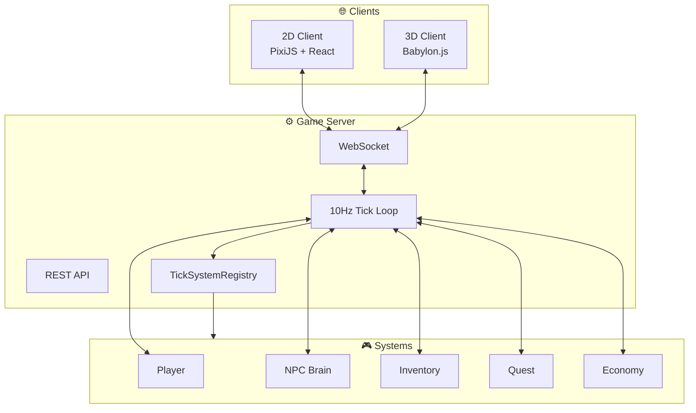

# Areloria WASD

<div style={{
  background: 'linear-gradient(135deg, rgba(0,212,170,0.08) 0%, rgba(123,45,142,0.08) 50%, rgba(0,180,216,0.08) 100%)',
  borderRadius: '12px',
  padding: '28px',
  marginBottom: '32px',
  border: '1px solid rgba(0,212,170,0.25)',
  position: 'relative',
  overflow: 'hidden'
}}>

**Areloria WASD** is a browser-native deterministic MMORPG engine and living-world simulation platform. Built with Node.js, WebSockets, PixiJS, and Babylon.js.

</div>

| | |
|---|---|
|  | Server-authoritative tick-based world simulation |
|  | PixiJS + React isometric rendering |
|  | Babylon.js extended visualization |

## What is Areloria?

Areloria is not a simple web game. It is a **mathematically disciplined, deterministic living-world engine** for a browser MMORPG.

<CardGroup cols={2}>
  <Card title="Server Authority" icon="shield" href="/mintlify/architecture/server">
    All game state is validated and mutated authoritatively on the server. Clients render what the server confirms.
  </Card>
  <Card title="Deterministic Simulation" icon="zap" href="/mintlify/architecture/determinism">
    Every gameplay outcome is reproducible from explicit inputs. No hidden randomness, no client authority.
  </Card>
  <Card title="Living NPCs" icon="brain" href="/mintlify/gameplay/npc-systems">
    NPCs remember local events, react to player history, and participate in emergent civilization.
  </Card>
  <Card title="2D & 3D Clients" icon="layers" href="/mintlify/architecture/client">
    Primary 2D rendering via PixiJS v7 + React. 3D via Babylon.js when needed.
  </Card>
</CardGroup>

## Core Truth Rule

Every feature in Areloria follows this fundamental architectural commitment:

```text
Kein Snapshot, kein Spiel.
Kein Tick, keine Wahrheit.
Kein Guard, keine Architektur.
Kein /2d Proof, keine Integration.
```

A feature is **real** only when verifiable through the active runtime path, server state, generated manifest, replay/state hash, or CI/smoke test.

<Card title="Truth Path Contract" icon="scroll" href="/mintlify/architecture/truth-path">
  The 8 verification gates that define what makes a feature real in Areloria.
</Card>

## Architecture

| Component | Technology | Purpose |
|-----------|-----------|---------|
| **Game Server** | Node.js + Express + WebSocket | Authoritative 10Hz simulation |
| **2D Client** | PixiJS v7 + React | Primary isometric rendering |
| **3D Client** | Babylon.js + Vite | Extended visualization |
| **Persistence** | PostgreSQL / JSON fallback | Player & world state |
| **Assets** | Stitch 2.5D sprite atlas | Visual content pipeline |
| **Simulation** | ARE Logic Engine | Deterministic rule system |

## System Flow



## Vision

The world should feel **inhabited** rather than merely scripted. NPCs are future citizens, workers, traders, witnesses, political actors, enemies, allies, informants, settlers, rulers, rebels, and memory-bearing participants in a simulated civilization.

- NPCs remember local events and react to player history
- Villages, towns, cities emerge from deterministic rules
- Trade routes, taxes, elections become systemic forces
- Oracle systems observe patterns and expose world-thought

---

<CardGroup cols={3}>
  <Card title="🚀 Quickstart" icon="rocket" href="/mintlify/quickstart">
    Get up in 5 minutes
  </Card>
  <Card title="🏗️ Architecture" icon="building" href="/mintlify/architecture/overview">
    System design
  </Card>
  <Card title="📜 Truth Path" icon="file-text" href="/mintlify/architecture/truth-path">
    Architectural commitment
  </Card>
  <Card title="🎮 Gameplay" icon="gamepad-2" href="/mintlify/gameplay/overview">
    Living world systems
  </Card>
  <Card title="☁️ Deployment" icon="cloud" href="/mintlify/deployment/vps">
    VPS production
  </Card>
  <Card title="📡 API" icon="radio" href="/mintlify/api/overview">
    REST & WebSocket
  </Card>
</CardGroup>

---

*The world may become strange. But never non-deterministic by accident.*
